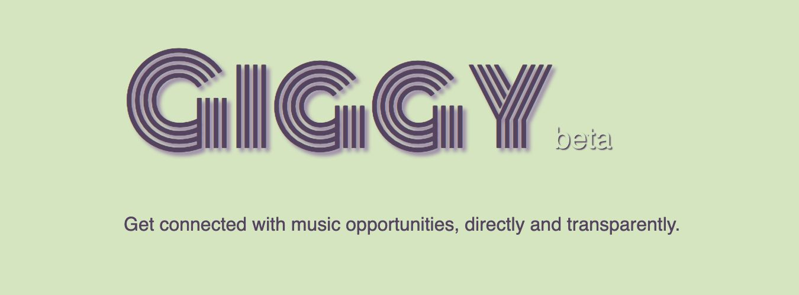
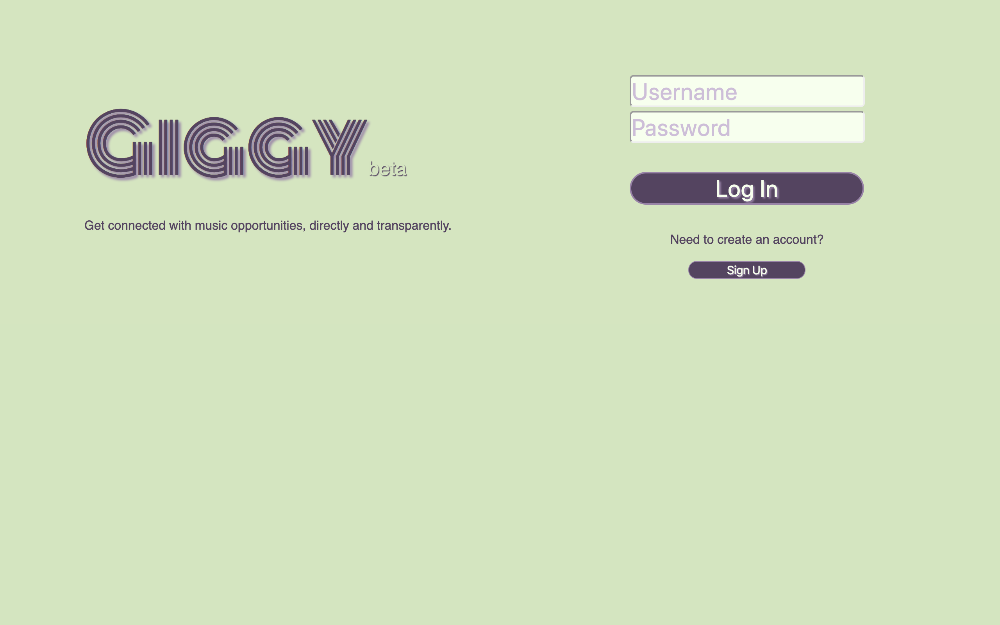
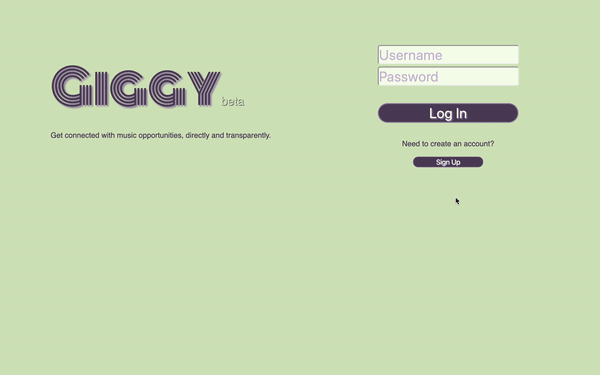
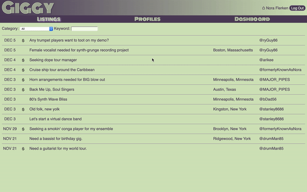
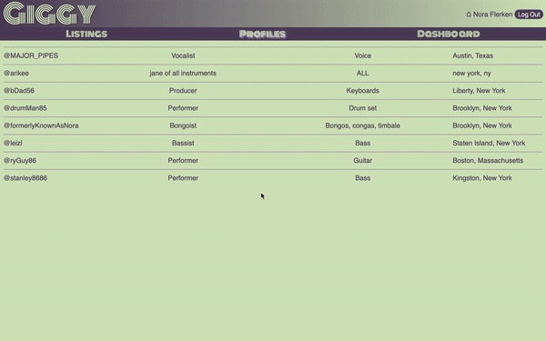
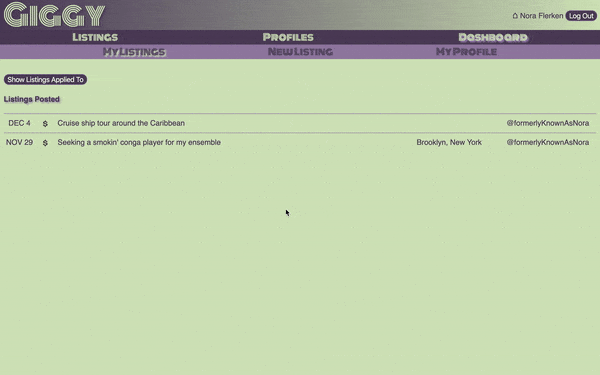

Giggy is an app for musicians to post, browse, search, and apply to listings for music opportunities.
It is a project application done for module 5 of Flatiron School. Besides smoothing up existing 
features, refactoring certain code blocks, and seeking out bugs, the main to-dos are:
  - implement user-to-user messaging
  - enhance search and filter options
  - beautify show pages

## Author
  - Dan Romans | [dangrammer](https://github.com/dangrammer)

## Backend Repository
  - [Giggy API](https://github.com/dangrammer/giggy-backend)

## Languages/Libraries:

  - HTML5 (JSX)
  - CSS3 (customized - no templates)
  - ES6 JavaScript
  - React ^16.12.0 
  - React-Dom ^16.12.0 
  - React-Redux ^7.1.3 
  - React-Router ^5.1.2 
  - React-Router-Dom ^5.1.2 
  - React-Scripts ^3.2.0 
  - Redux ^4.0.4 
  - Redux-thunk ^2.3.0 
  - Redux-Devtools-Extension ^2.13.8

  *_This application exclusivley uses functional components and React hooks_.

## Live Demo
  Link to walkthrough video with narration:
   
    

## Screenshots

  Login/Signup
   
  

  Listings
   
  

  Profiles
   
  

  Dashboard
   
  

## How To Install and Run 

  1. install and run [Giggy backend API](https://github.com/dangrammer/giggy-backend)
  2. fork (optional) then clone or download this repository to local machine
  3. use text editor and/or terminal to navigate into `giggy-frontend` directory
  4. run `npm install` (or `npm i`) in terminal to install necessary dependencies
  5. run `npm start` in terminal to launch the app in browser

  *_Note: If backend server is already running, it will be running on http://localhost:3000/. After 
  running_ `npm start`_, follow prompt and enter_ `y` _in terminal to run frontend on alternate port._
